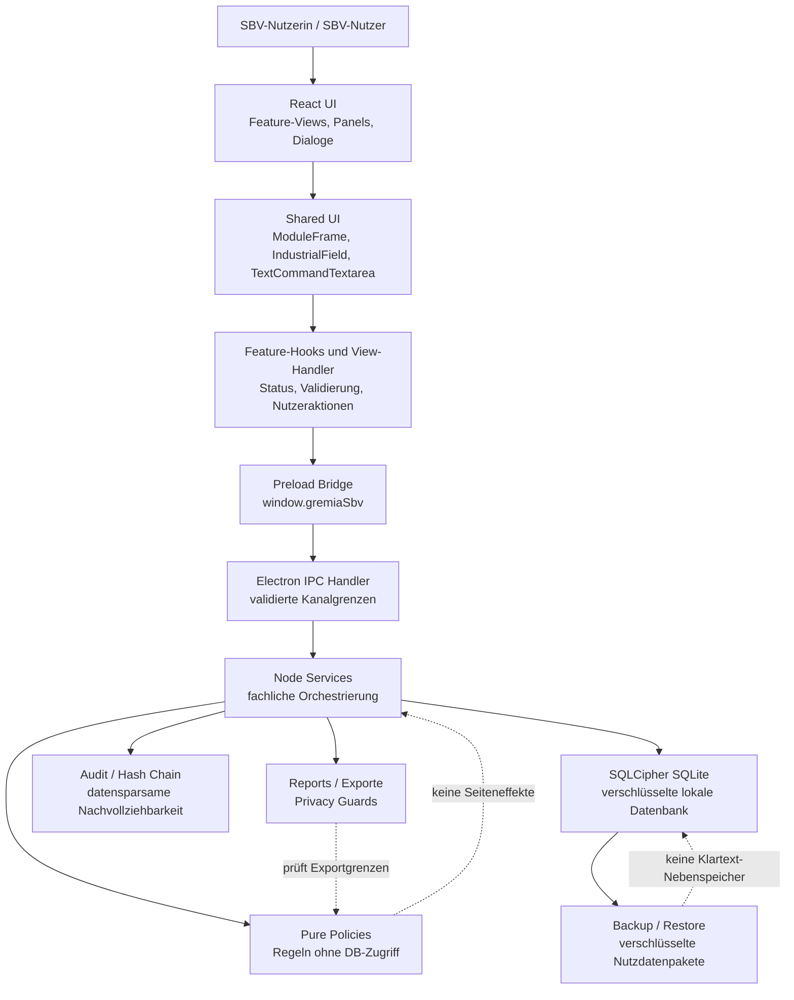
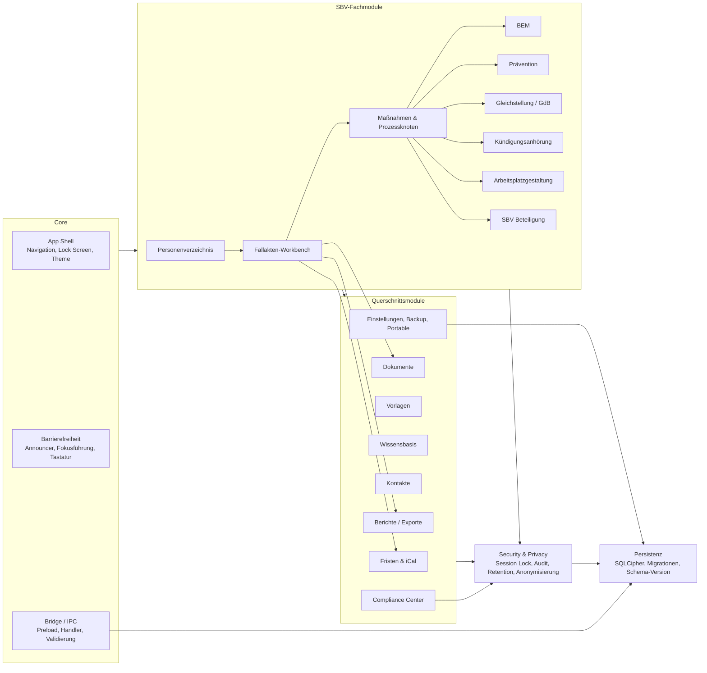

# Architekturdiagramme

Stand: **0.9.1**

Diese Seite ergänzt `ARCHITECTURE.md` um zwei bewusst grobe Mermaid-Sichten. Sie soll neuen Entwicklerinnen und Entwicklern schnell zeigen, wie Daten durch Gremia.SBV laufen und welche Hauptkomponenten fachlich zusammengehören.

## Datenfluss UI bis Datenbank

### Lesart

Die UI spricht nie direkt mit der Datenbank. Fachliche Regeln liegen als testbare Policies oder Services vor. Electron-IPC bildet die Sicherheits- und Validierungsgrenze zwischen Renderer und Node-Kontext. Persistenz erfolgt lokal in SQLCipher; Audit, Backup und Exporte sind eigene Pfade und dürfen keine unkontrollierten personenbezogenen Nebenablagen erzeugen.

## Grobe Komponentensicht der Anwendung

### Lesart

Die Fallakten-Workbench ist der fachliche Mittelpunkt. Das Personenverzeichnis führt Schutz- und Beschäftigungsstatus; Fallakten und Maßnahmen hängen daran. Prozessmodule wie BEM, Prävention, Gleichstellung, Kündigungsanhörung und Arbeitsplatzgestaltung nutzen dieselben Grundmuster für Maßnahmen, Fristen, Notizen, Dokumente und Datenschutzprüfung. Querschnittsmodule dürfen die Fachmodule unterstützen, aber keine parallelen Schattenprozesse erzeugen.

## Architekturregeln aus den Diagrammen

1. **Renderer bleibt fachlich dünn:** UI-Komponenten sammeln Eingaben, zeigen Status an und rufen Bridge-Funktionen auf.
2. **IPC ist Grenze:** Jeder Renderer-Aufruf wird über Preload und IPC geführt; keine direkten Node- oder Datenbankzugriffe aus React.
3. **Policies bleiben rein:** Regeln zu Datenschutz, Export, Fristen, Workflows und Anonymisierung müssen ohne Datenbank und ohne UI testbar sein.
4. **Services orchestrieren:** Services verbinden Policies, Datenbank, Audit und Exporte; sie enthalten keine Präsentationslogik.
5. **Datenschutz ist Querschnitt:** Anonymisierung, Löschung, Retention, Audit und Export-Guards müssen neue Fachobjekte ausdrücklich einbeziehen.
6. **Keine Parallelwelten:** Neue Funktionen verwenden vorhandene Workbench-, Prozess-, Fristen-, Notiz- und Inline-Befehlsmuster statt eigene Sonderpfade aufzubauen.
